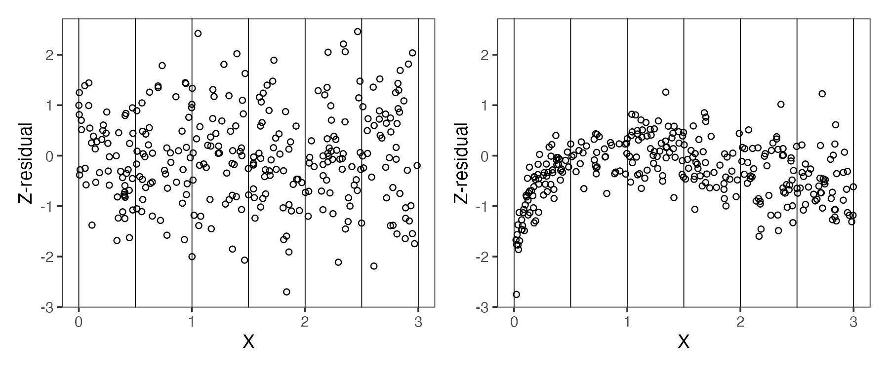
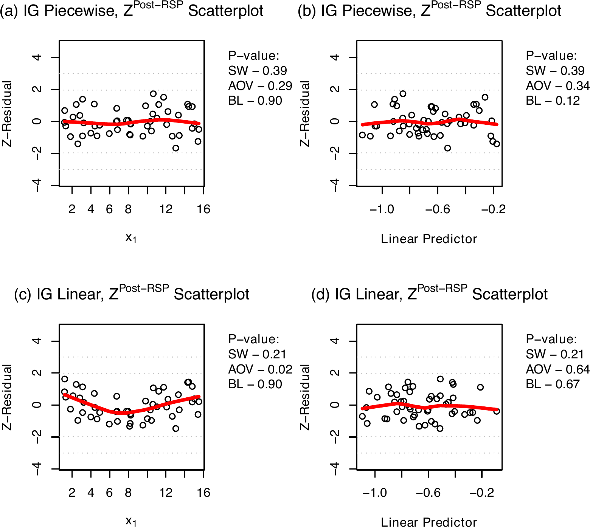
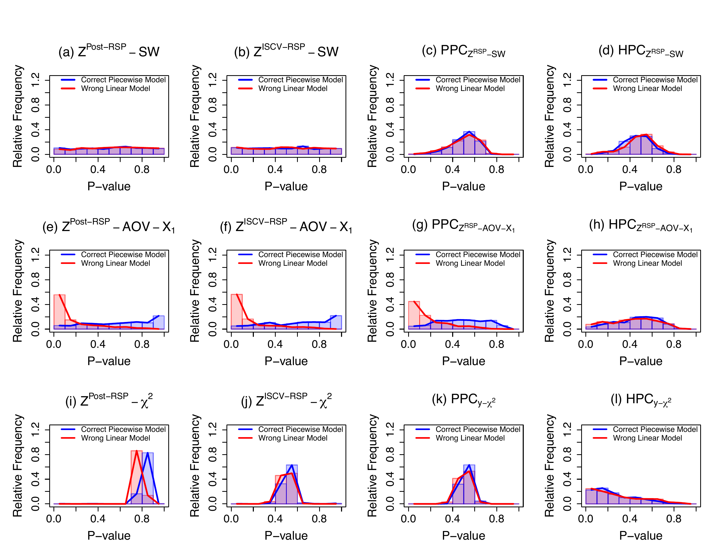
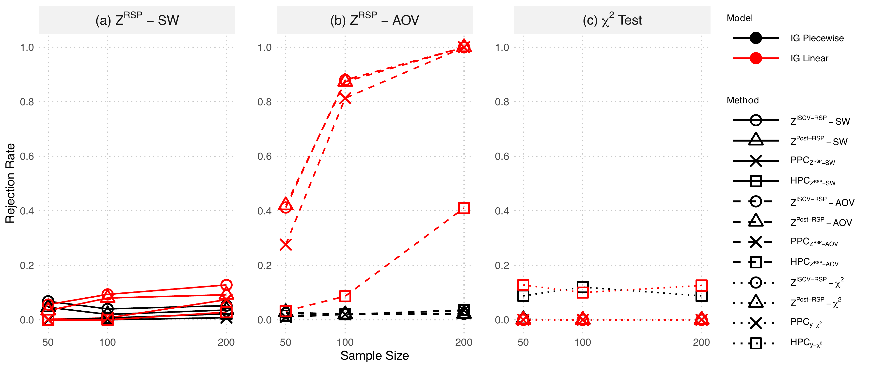
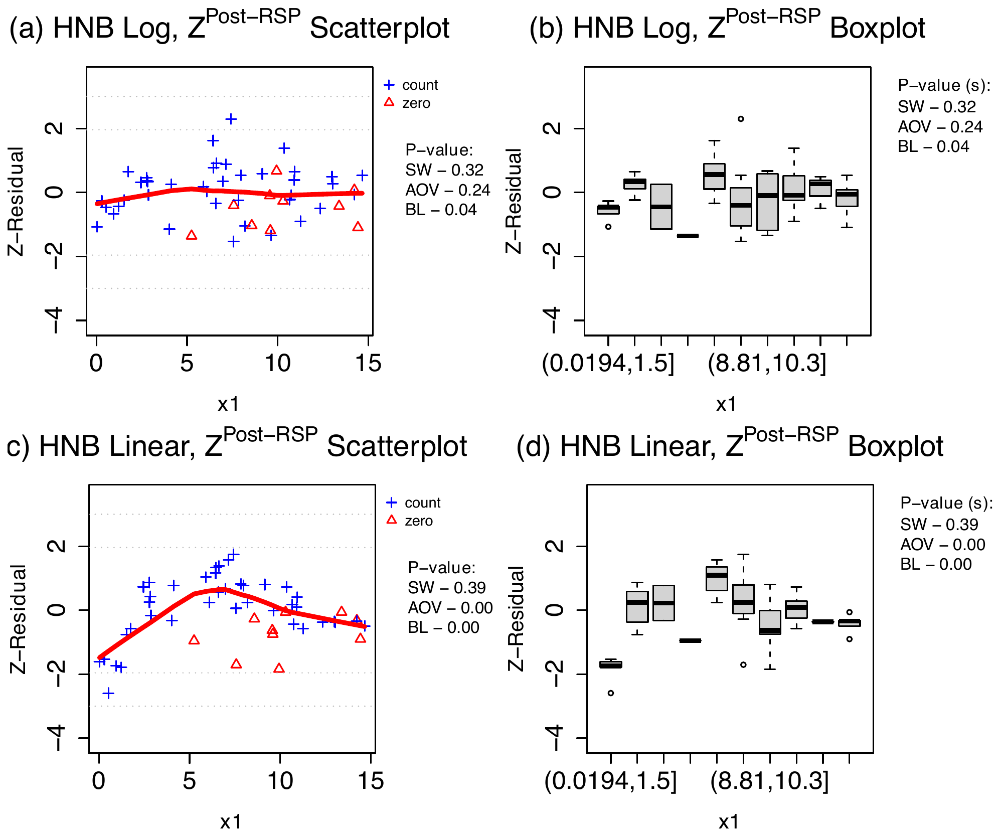
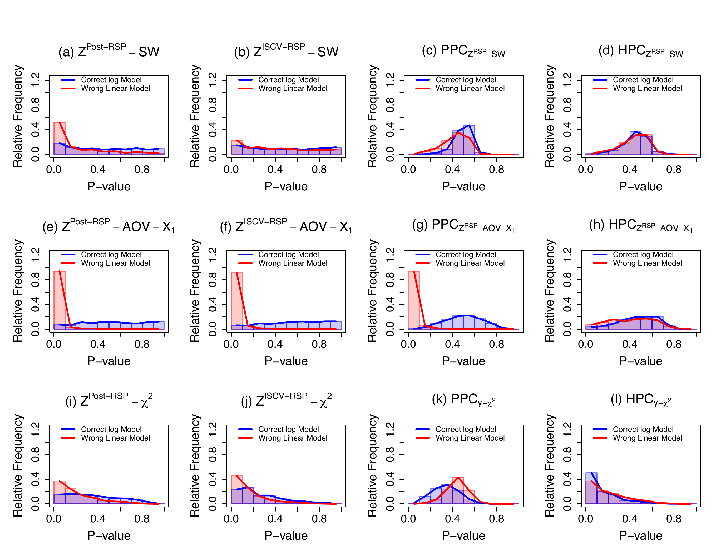
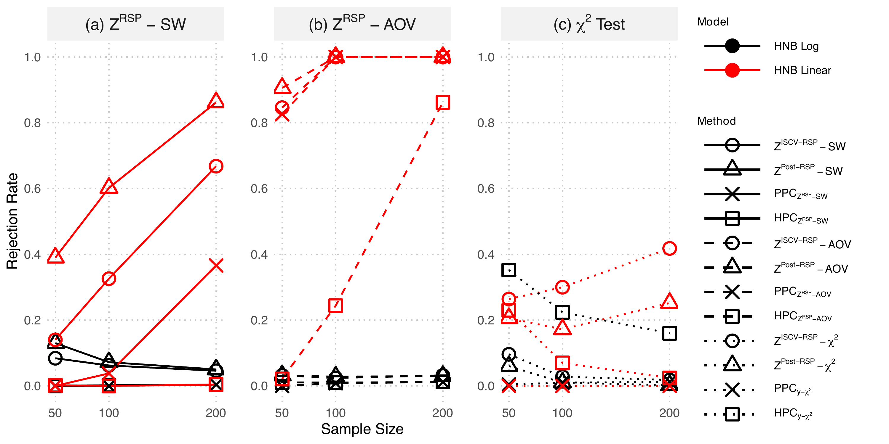

# Acknowledgments {.unnumbered}

* Special thanks to Prof. Wei Xu for hosting my visit to the University of Toronto.

* Grateful acknowledgement is given to the Natural Sciences and Engineering Research Council of Canada (NSERC) for funding this work.

# Introduction

::: {.content-visible when-format="html"}

:::

## Where We Stand: Current Model Checking Methods

* **Frequentist Residual Diagnostics:** In OLS, observation-level residuals play important roles for visualizing and quantifying overall and specific structural flaws (e.g., normality, nonlinearity, heteroskedasticity, spatial and temporal dependency).

* **The Gap in Assessing Bayesian Model:s** This comprehensive diagnostic toolkit is largely unavailable for general Bayesian models

* **Limitations of Posterior Predictive Checks (PPC)**

  * **Arbitrary Statistics:** Operates on a *test-first, then-summarize* paradigm, requiring subjective choices for dataset-level discrepancy statistics.
  * **Masked Flaws:** Relying on marginal distribution checks often fails to detect subtle covariate-specific or other structural misspecifications.
  * **Double-Use Bias:** Evaluating the statistic on the exact data used for fitting degrades statistical power, causing $p$-values to cluster around 0.5.
  * **Trade-offs in Alternatives:** Methods like holdout predictive checks (HPC) mitigate bias but sacrifice effective sample size and power.

## Z-residual Diagnostics

* **A Versatile Diagnostic Framework:** Introduces observation-level residuals for Bayesian models based on Randomized Survival Probability (RSP).
* **"Summarize-first, then-test":** Averages parameter-wise RSPs over the posterior (or LOO posterior) before transforming them into standard normal Z-residuals.
* **Key Advantages of Z-residuals:**
  * **Asymptotically Calibrated:** Diagnostic $p$-values are uniformly distributed under the true model, overcoming PPC's double-use bias.
  * **Diagnostic Richness:** Enables the use of familiar graphical tools (scatterplots, QQ plots) and structural tests (ANOVA, Shapiro-Wilk) on a single set of residuals.
  * **Preserved Power:** Utilizes the full sample size to detect model misspecifications without the reductions required by holdout methods.

# Posterior and Holdout Predictive Checks

## Posterior Predictive P-value ($\PPP$)

* **Concept:** $\PPP$ is a goodness-of-fit measure comparing observed data ($\by^{\text{obs}}$) to replicated data ($\by^{\text{rep}}$) from the posterior predictive model. Good models generate replicates similar to the observed data.
* **Discrepancy Statistic $D(\by, \btheta)$:** Summarizes specific data features (potentially depending on parameters $\btheta$). $\PPP$ is the probability that the replicated discrepancy exceeds the observed one:
  $$ \PPP = P(D(\by^{\text{rep}}, \btheta) > D(\by^{\text{obs}}, \btheta) \mid \by^{\text{obs}}) $$
* **A Key Simplification (Meng, 1994):** If the discrepancy is a well-calibrated $p$-value, $\mathcal{P}(\by, \btheta)$, its replicate is exactly $\mathrm{Unif}(0,1)$. By the law of iterated expectations, $\PPP$ simplifies to the posterior average of observed $p$-values:
  $$ \PPP = \E(\pv(\by^{\text{obs}}, \btheta) \mid \by^{\text{obs}}) $$

## Computing Procedures of PPP

1. **Sample from Posterior:**
Begin with a set of posterior samples $\{\btheta_{t}\}_{t=1}^T$.

2. **Compute Discrepancy Statistics:** For each sample $t$, compute two statistics:
* **Replicated Statistic (optional):**  $D^{\text{rep}}_{t}$ calculated with $\boldsymbol{y}_{t}^{\text{rep}} \sim p(\boldsymbol{y} \mid \btheta_{t})$
* **Observed Statistic:** $D^\text{obs}_{t}$ calculated with the actual data $\boldsymbol{y}^\text{obs}$


3. **Aggregate & Compare:** 
Collect all $T$ results and calculate the proportion of draws where the replicated statistic is greater than or equal to the observed statistic; alternatively, calculate the posterior mean of $p$-values:

$$
\widehat{\PPP} = \frac{1}{T} \sum_{t=1}^{T} I(D_{t}^{\text{rep}} \ge D_{t}^\text{obs}), \text{ or, } \widehat{\PPP}= \frac{1}{T}\sum_{t=1}^{T} \pv(\by^{\text{obs}},\btheta^{(t)})
$$

## Limitations of PPC and HPC

1. **Arbitrary Discrepancy Measures:**
   The selection of the test statistic, $D(\by, \btheta)$, is inherently arbitrary, lacking guidelines from data fitting results.

2. **Masking of Structural Flaws:**
   Relying on simple, marginal statistics (e.g., mean, median, $\chi^2$ statistic) can yield a "passing" score while hiding critical deficiencies like misspecified covariate functional forms.

3. **The "Test-First, Then-Summarize" Paradigm:**
   Computing dataset-level discrepancies for every MCMC draw evaluates the model against its exact training data, severely exacerbating double-use bias.

4. **Poor Calibration & Low Power:**
   Due to double-use bias, PPC $p$-values (especially $\chi^2$) are rarely uniform under the null. They artificially cluster around $0.5$, crippling the test's power to detect true model misfit.

5. **The Holdout Predictive Check (HPC) Compromise:**
   Recently proposed to replace PPCs, HPC splits the data into training and test sets to eliminate double-use bias. However, this data-splitting drastically reduces the effective sample size, leading to a severe loss of statistical power and instability in the evaluation.

# The Z-residual Framework

## Randomized Survival Probability (RSP)


* For an observed $y_i$, the parameter-wise RSP is:
  $$ \text{RSP}_i(y_i \mid \boldsymbol{\theta}) = S_i(y_i \mid \boldsymbol{\theta}) + U_i \cdot p_i(y_i \mid \boldsymbol{\theta}) $$
  * $S_i$: Survival function $P(Y_i > y_i \mid \boldsymbol{\theta})$
  * $p_i$: Probability mass function $P(Y_i = y_i \mid \boldsymbol{\theta})$
  * $U_i \sim \text{Unif}(0,1)$: Auxiliary randomization
* **Auxiliary Randomization $U_i$**
  * **Continuous**: $p_i = 0$, simplifies to the standard probability integral transform.
  * **Discrete**: Randomization ensures exact uniform distribution on $[0,1]$. Essentially, the randomization recovers the continuous latent constructs of a discrete $y_i$ by injecting random noise. 

## The Parameter-wise Z-residual

* Transform the uniform RSP into a standard normal residual using the inverse-survival function of $N(0,1)$:
  $$ z_i^{\text{RSP}}(y_i \mid \boldsymbol{\theta}) = -\Phi^{-1}(\text{RSP}_i(y_i \mid \boldsymbol{\theta})) $$
* **Interpretation:**
  * Negative sign preserves traditional residual direction (larger observations = positive residuals).
  * Represents distance from $y_i$ to its predictive median, rescaled for skewness and smoothed for discreteness.
  * Under the true model, 
   $$z_i^{\text{RSP}}(y_i \mid \boldsymbol{\theta})  \sim N(0,1)$$

## Illustration of Z-residuals: Under Correct Models

<video src="slidesplot/z_residual_anim-correct.mp4" height="900" style="display: block; margin: 0 auto;" controls loop muted></video>

## Illustration of Z-residuals: Under Wrong Models

<video src="slidesplot/z_residual_anim-wrong.mp4" height="900" style="display: block; margin: 0 auto;" controls loop muted></video>


## Posterior Z-residuals 

* For a fitted Bayesian model, we can average the pointwise RSP over the posterior distribution $\pi(\boldsymbol{\theta} \mid \mathbf{y})$, resuting in   **Posterior RSP:**
  $$ \widehat{\text{RSP}}_i^{\text{post}}(y_i) = \frac{1}{T} \sum_{t=1}^T \text{RSP}_i(y_i \mid \boldsymbol{\theta}^{(t)}) $$
* **Posterior Z-residual:**
  $$ z_i^{\text{post}}(y_i) = -\Phi^{-1}\left(\widehat{\text{RSP}}_i^{\text{post}}(y_i)\right) $$


 
## ISCV Z-residuals for Mitigating Data Double-use

* Posterior Z-residuals use $\mathbf{y}$ twice. To mitigate finite-sample bias, we approximate Leave-One-Out (LOO) cross-validation via Importance Sampling (ISCV).
* **Importance weight**: 
Reweigh each MCMC sample $\btheta^{(t)}$ for each $y_i$ differently with the inverse-likelihood 
$$w_i^{\text{IS}}(\boldsymbol{\theta}^{(t)}) = {1 \over f_i(y_i \mid \boldsymbol{\theta}^{(t)})}$$
* **ISCV RSP:**
  $$ \widehat{\text{RSP}}_i^{\text{ISCV}}(y_i) = \frac{\sum_{t=1}^T \left[ \text{RSP}_i(y_i \mid \boldsymbol{\theta}^{(t)}) w_i^{\text{IS}}(\boldsymbol{\theta}^{(t)}) \right]}{\sum_{t=1}^T w_i^{\text{IS}}(\boldsymbol{\theta}^{(t)})} $$
* **ISCV Z-residual:**
  $$ z_i^{\text{ISCV}}(y_i) = -\Phi^{-1}\left(\widehat{\text{RSP}}_i^{\text{ISCV}}(y_i)\right) $$

## A Paradigm Shift

```{r}
#| echo: false
#| message: false
#| warning: false

library(gt)
library(tibble)

# 1. Create the data frame
tibble(
  Feature = c("**Workflow**", "**Calibration**", "**Power**", "**Versatility**"),
  
  PPC = c("**Test-first, then-summarize**<br><br>Simulate statistic $T$ or computing a test $p$-value for every MCMC draw, then average $p$-values.",
          "Conservative bias scaling with $p$.",
          "Low if using marginal checks or HPC.",
          "Requires extra guidance for choosing discrepancy statistics."),
  
  Z_res = c("**Summarize-first, then-test**<br><br>Average predictive density of $f(y_i\\vert{}\\bm{\\theta}^{(t)})$ over MCMC draws, compute *single* set of $Z$.",
          "Asymptotically uniform/normal.",
          "High (full sample size used).",
          "Enables a wide range of diagnostic tests and tools for OLS: normality/nonlinearity/heteroskedasticity tests.")
) |> 
  
  # 2. Build and format the gt table
  gt() |> 
  cols_label(
    Feature = "Feature",
    PPC = "PPC/HPC",
    Z_res = "Z-residuals Diagnostics"
  ) |> 
  
  # Render the Markdown and KaTeX math safely
  fmt_markdown(columns = everything()) |> 
  
  # Lock in your exact column widths 
  cols_width(
    Feature ~ pct(15),
    PPC ~ pct(35),
    Z_res ~ pct(50)
  ) |> 
  
  # Ensure standard left-alignment
  cols_align(align = "left", columns = everything()) |> 
  
  # Make it stretch to the slide edges and scale the font size
  tab_options(
    table.width = pct(100),
    table.font.size = "0.95em",
    table.background.color = "transparent" ) |>
  # Force vertical alignment to the top for all body cells
  tab_style(
    style = cell_text(v_align = "top"),
    locations = cells_body()     
  ) |>
  # Force column labels to be bold
  tab_style(
    style = cell_text(weight = "bold"),
    locations = cells_column_labels()
  )

```

## Computing Procedures: PPC/HPC 

::: {style="font-size: 33px;"}

|     | $y_1$ | $y_2$ | $\cdots$ | $y_n$ |       |     | 
| --- | ------- | ------- | ---     | -------     | --- | --- |
| $\btheta^{(1)}$ | $z_1^{\rsp}(y_1 \mid \btheta^{(1)})$ | $z_2^{\rsp}(y_2 \mid \btheta^{(1)})$ | $\cdots$ | $z_n^{\rsp}(y_n \mid \btheta^{(1)})$ | $\xrightarrow{\text{Test}}$ | $p_1\sobs$ |
| $\btheta^{(2)}$ | $z_1^{\rsp}(y_1 \mid \btheta^{(2)})$ | $z_2^{\rsp}(y_2 \mid \btheta^{(2)})$ | $\cdots$ | $z_n^{\rsp}(y_n \mid \btheta^{(2)})$ | $\xrightarrow{\text{Test}}$ | $p_2\sobs$ |
| $\vdots$ | $\vdots$ | $\vdots$ | $\ddots$ | $\vdots$ |  | $\vdots$ |
| $\btheta^{(T)}$ | $z_1^{\rsp}(y_1 \mid \btheta^{(T)})$ | $z_2^{\rsp}(y_2 \mid \btheta^{(T)})$ | $\cdots$ | $z_n^{\rsp}(y_n \mid \btheta^{(T)})$ | $\xrightarrow{\text{Test}}$ | $p_T\sobs$ |
|  |  |  |  |  |  | $\Big\downarrow \text{Mean}$ <br> **PPP** |

:::

## Computing Procedures: Z-Residual Diagnostics

::: {style="font-size: 33px;"}

|  | $y_1$ | $y_2$ | $\cdots$ | $y_n$ |  |  |
| --- | ------- | ------- | ---     | -------     | -- | --- |
| $\btheta^{(1)}$ | $\rsp_1(y_1 \mid \btheta^{(1)})$ | $\rsp_2(y_2 \mid \btheta^{(1)})$ | $\cdots$ | $\rsp_n(y_n \mid \btheta^{(1)})$ |  |  |
| $\btheta^{(2)}$ | $\rsp_1(y_1 \mid \btheta^{(2)})$ | $\rsp_2(y_2 \mid \btheta^{(2)})$ | $\cdots$ | $\rsp_n(y_n \mid \btheta^{(2)})$ |  |  |
| $\vdots$ | $\vdots$ | $\vdots$ | $\ddots$ | $\vdots$ |  |  |
| $\btheta^{(T)}$ | $\rsp_1(y_1 \mid \btheta^{(T)})$ | $\rsp_2(y_2 \mid \btheta^{(T)})$ | $\cdots$ | $\rsp_n(y_n \mid \btheta^{(T)})$ |  |  |
|  | $\downarrow$ | $\downarrow$ |  | $\downarrow$ |  |  |
| $z_i^{\rsp}$ | $z^{\rsp}_1(y_1)$ | $z^{\rsp}_2(y_2)$ | $\cdots$ | $z^{\rsp}_n(y_n)$ | $\xrightarrow{\text{Test}}$ | $Z^{\rsp}$ <br>$p$-value |
:::


## Asymptotic Properties of Posterior or CV Z-residuals

::: {style="font-size: 0.9em;"}


* **Theorem 1** (Convergence of the LOO Predictive Distribution).
  *Suppose the model is correctly specified and satisfies standard regularity conditions (ensuring posterior consistency and predictive continuity). As the sample size $n \to \infty$, the Leave-One-Out (CV) predictive distribution, $P_i^{(n),\mathrm{CV}}$, converges to the true data-generating distribution, $P_i^{(*)}$, in total variation distance, in probability:*

  $$ \big\Vert P_i^{(n),\mathrm{CV}} - P_i^{(*)} \big\Vert_{\mathrm{TV}} \xrightarrow{P} 0 $$

  *Because the predictive distributions lock onto the true data-generating process, the resulting RSPs inherit the correct limiting behavior—not just individually, but jointly across observations:*

* **Theorem 2** (Asymptotic Independence of CV RSPs).
  *Under the same regularity conditions, for any pair of distinct observations $i \neq j$, their cross-validated RSPs converge jointly in distribution to independent standard uniform variables as $n \to \infty$:*

  $$ \big(\mathrm{RSP}_i^{(n),\mathrm{CV}},\, \mathrm{RSP}_j^{(n),\mathrm{CV}}\big) \ \Rightarrow\ \big(\mathrm{Uniform}(0,1),\,\mathrm{Uniform}(0,1)\big) $$
* The theorems can be extended to posterior Z-residuals as the posterior predictive and CV predictive distributions of $y_i$ are asymptotically equivalent.

:::

## Model Diagnostics with Z-residuals

* Z-residuals behave like classical regression residuals — no fixed test, so many graphical/numerical tools apply.
* **Marginal Checking:** QQ plot + Shapiro-Wilk test. ($\chi^2$ test not recommended — too sensitive to posterior variance shrinkage/inflation.)
* **Targeted Covariate Checks:** residual-vs-covariate plots should be structureless.
  * **Discrete:** AOV (mean) + Bartlett (variance) across categories.
  * **Continuous:** bin into $k$ intervals, then apply the same tests.

* **No Rigid Order:** a synthesis, not a checklist — mean-structure errors can cascade into marginal QQ/SW failures.
* **Multiple Comparisons:** not a primary concern — the goal is *non-significant* $p$-values, so false positives are low-cost. **Exception**: mining many unused covariates or a large test battery needs FDR/e-value/data-splitting correction.

## Illustration: Constructing the Z-AOV Test

```{r}
#| include: false
#| eval: false
# Two synthetic Z-residual-vs-covariate scatterplots illustrating the Z-AOV
# test: left panel is homogeneous noise N(0,1); right panel has a log-shaped
# mean trend and linearly increasing variance in X. Combined 1x2 via
# patchwork, sharing the same X range and Y limits for a fair comparison.
library(ggplot2)
library(patchwork)

set.seed(42)
n <- 300
breaks <- seq(0, 3, by = 0.5)

x1 <- runif(n, 0, 3)
y1 <- rnorm(n, mean = 0, sd = 1)
df1 <- data.frame(X = x1, Z = y1)

x2 <- runif(n, 0, 3)
y2 <- rnorm(n, mean = log(3*x2 + 0.1)-x2, sd = 0.3 + 0.1 * x2)
df2 <- data.frame(X = x2, Z = y2)

ylims <- range(c(df1$Z, df2$Z))

theme_z <- theme_bw(base_size = 18) +
  theme(panel.grid = element_blank(),
        plot.background = element_rect(fill = "transparent", color = NA),
        panel.background = element_rect(fill = "transparent", color = NA))

p1 <- ggplot(df1, aes(X, Z)) +
  geom_vline(xintercept = breaks, linewidth = 0.4) +
  geom_point(shape = 1, size = 2.2) +
  coord_cartesian(ylim = ylims) +
  labs(x = "X", y = "Z-residual") +
  theme_z

p2 <- ggplot(df2, aes(X, Z)) +
  geom_vline(xintercept = breaks, linewidth = 0.4) +
  geom_point(shape = 1, size = 2.2) +
  coord_cartesian(ylim = ylims) +
  labs(x = "X", y = "Z-residual") +
  theme_z

# `&` (not `+`) applies theme_z to the whole patchwork composition, not just
# each subplot -- otherwise patchwork's own outer canvas stays opaque white
# even when each individual panel's background is transparent.
combined <- (p1 + p2) & theme_z
ggsave("slidesplot/z_aov_illustration.png", combined, width = 12, height = 5,
       dpi = 150, bg = "transparent", device = ragg::agg_png)
```



* Divide Z-residuals by a covariate (or linear predictor) into equally spaced intervals, then test the equality of the grouped means with an ANOVA $F$-test.
* **Left:** homogeneous groups (no trend) — the null case.
* **Right:** a clear group-mean trend, which the Z-AOV test is designed to detect.


## Summarizing Replicated Test $p$-values for Discrete Models

::: {style="font-size: 1em;"}

* For discrete data, auxiliary randomization $\mathbf{U}$ means test $p$-values vary across random seeds.
* **Solution:** Replicate $J$ sets of Z-residuals, and calculate a $p$-value for each set of Z-residuals, yielding replicated $p$-values $\{p_j(\mathbf{y})\}_{j=1}^J$, then summarize these $p$-values.

```{r}
#| echo: false
#| fig-width: 14
#| fig-height: 5
#| fig-align: center
#| dev.args: {bg: "transparent"}

set.seed(2024)
J <- 200
H <- 1.72  # H_{200,100}, from the table on the next slide

p_good <- rbeta(J, 5, 10)
p_bad  <- rbeta(J, 1, 50)

ub_good <- min(1, H * median(p_good))
ub_bad  <- min(1, H * median(p_bad))

par(mfrow = c(1, 2), oma = c(4, 0, 0, 0), mar = c(4, 4, 3, 1), bg = NA)

hist(p_good, breaks = 20, col = "cyan4", border = "white", xlim = c(0, 1),
     xlab = "replicated p-value", main = sprintf(
       "Well-fitting model\nmedian ub p-value = %.3f", ub_good))
abline(v = ub_good, col = "red", lwd = 2)
abline(v = 0.05, col = "blue", lty = 2, lwd = 2)

hist(p_bad, breaks = 20, col = "cyan4", border = "white", xlim = c(0, 1),
     xlab = "replicated p-value", main = sprintf(
       "Poorly-fitting model\nmedian ub p-value = %.3f", ub_bad))
abline(v = ub_bad, col = "red", lwd = 2)
abline(v = 0.05, col = "blue", lty = 2, lwd = 2)

par(fig = c(0, 1, 0, 1), oma = c(0, 0, 0, 0), mar = c(0, 0, 0, 0), new = TRUE)
plot(0, 0, type = "n", bty = "n", xaxt = "n", yaxt = "n", xlab = "", ylab = "")
legend("bottom", legend = c("Upper-bound p-value", "0.05 threshold"),
       col = c("red", "blue"), lty = c(1, 2), lwd = 2, horiz = TRUE,
       bty = "n", xpd = NA)
```

:::

## A Distribution-free Upper-Bound $p$-value for Order Statistics of Replicated $p$-values

::: {style="font-size: 0.85em;"}

* **Theorem 3** (Distribution-free Upper-bound for Order Statistics of Replicated $p$-values).
  
  Let $\pv(\by,\bU)\in[0,1]$ be a $p$-value computed from data $\by$ and auxiliary randomness $\bU$. Let $p_j(\by)=\pv(\by,\bU^{(j)})$ and let $p_{(r)}(\by)$ be their $r$-th order statistic. Define
  $H_{J,r} := \sup_{p\in(0,1]} P\{\mathrm{Binom}(J,p)\ge r\}/{p}.$ Then, for any threshold $t\in[0,1]$, $P\{p_{(r)}(\bY) \le t\} \le H_{J,r} \cdot t$

* **Upper-bound $p$-value:**  
$$
\pv_{(r)}^{\mathrm{ub}}(\by) := \min\{1,\, H_{J,r}\cdot p_{(r)}(\by)\}
$$ 


* The calibration constant $H_{J,r}$ can be computed using numerical optimization. Representative values for the median ($r=\lceil J/2 \rceil$):

  | $J$ | 50 | 100 | 200 | 500 | 800 | 1000 | 1500 | 2000 |
  |---|---|---|---|---|---|---|---|---|
  | $H_{J,r}$ | 1.57 | 1.65 | 1.72 | 1.80 | 1.83 | 1.85 | 1.87 | 1.88 |

* This upper-bound is better than 2, which can be derived using Markov Inequality.

:::


#  Simulation Studies

```{r}
#| include: false
#| eval: false
# Find all PDF files in the "plot" directory
pdf_files <- list.files(path = "plot", pattern = "\\.pdf$", full.names = TRUE)

# Loop through and convert each one
for (pdf in pdf_files) {
  # Define the new .png file name
  png_name <- sub("\\.pdf$", ".png", pdf)
  
  # Read with high resolution, make transparent, and save
  img <- magick::image_read_pdf(pdf, pages = 1, density = 300) |>
    magick::image_transparent(color = "white", fuzz = 2)
  
  magick::image_write(img, path = png_name, format = "png")
  
  cat("Converted:", png_name, "\n")
}
```

## Simulation 1: Inverse Gaussian (IG) Regression

::: {style="font-size: 1em;"}

* **Setup:** Continuous data, $n \in \{50, 100, 200\}$, 500 replicated datasets. No auxiliary randomization needed.
* **Piecewise Quadratic Effect on $X_1$** (knot $c = 7.95$):
  $$ B^{(i)} = (X_1^{(i)} - c)^2 I(X_1^{(i)} < c), \qquad A^{(i)} = (X_1^{(i)} - c)^2 I(X_1^{(i)} \ge c) $$
* **Data-Generating Model:**
  $$ Y_i \sim \mathrm{IG}(\mu_i, 25), \qquad \log(\mu_i) = -0.80 + 0.012B^{(i)} + 0.006A^{(i)} + \cdots $$
* **Fitted Models** (via `brms`):
  1. **Correct:** piecewise model with $B^{(i)}$ and $A^{(i)}$.
  2. **Misspecified:** linear model, replacing $B^{(i)}, A^{(i)}$ with a simple linear effect of $X_1^{(i)}$.
* **Goal:** Evaluate the ability of Z-residual diagnostics to detect this functional-form misspecification.

:::


```{r}
#| include: false
#| eval: false
# Crop the 1x4 panel figure (plot/piecewise_ig_fig_n50.png) into a 2x2 grid:
# left half (a,b) stacked above right half (c,d), then trim the outer
# whitespace border. Output committed as plot/piecewise_ig_fig_n50_2x2.png.
library(magick)

img <- image_read("plot/piecewise_ig_fig_n50.png")

top    <- image_crop(img, "1575x750+0+0")
bottom <- image_crop(img, "1575x750+1575+0")

combined <- image_append(c(top, bottom), stack = TRUE)
combined <- image_trim(combined)

image_write(combined, path = "plot/piecewise_ig_fig_n50_2x2.png")
```

## Scatterplots (IG, $n=50$) 

:::: {.columns style="display: flex; column-gap: 0; align-items: center;"}

::: {.column style="flex: 0 0 63%;"}

:::

::: {.column style="font-size: 1em;"}
* **Correct Model (Top)**: No trend against $X_1$ or fitted values.
* **Misspecified Model (Bottom):** Clear nonlinear pattern against $X_1$ (c), but masked when plotted against the overall linear predictor (d). *Covariate-specific plots are essential for this example.*
* Marginal checking with SW tests fail to identify the non-linearity. 
:::

::::


## Empirical $p$-value Distributions (IG, $n=50$)

:::: {.columns style="display: flex; align-items: center;"}

::: {.column style="width: 70%; flex: 0 0 70%;"}
{style="width: 100%; max-height: none;"}
:::

::: {.column style="width: 30%; flex: 0 0 30%; font-size: 0.7em; padding-left: 0px;"}
* **Blue** = Correct Model, **Red** = Misspecified Model.
* **SW (a, b):** near-uniform under *both* models — marginal normality isn't distorted by this localized misspecification, so SW lacks power.
* **Z-AOV vs $X_1$ (e, f):** near-uniform under the correct model, strongly concentrated near zero under the wrong one — the clearest, best-calibrated signal.
* **$\chi^2$ (i, j):** poorly calibrated even under the correct model (peaks near 0.8/0.5) — deflated Type-I error, little sensitivity.
* **PPC/HPC (c, d, k, l):** mound-shaped around 0.5 or skewed toward small $p$-values under *both* models — little power to separate them.
:::

::::


## Rejection Rates & Power (IG)



::: {style="font-size: 0.75em;"}

* **Setup:** **Black** = Correct model (target error $\alpha=0.05$). **Red** = Misspecified model (detection should rise with $n$).
* **Z-AOV (b) — Best Performer:** Achieves both exact calibration (stays near 0.05) and high power (reaches 100% rejection by $n=200$). Consistently outperforms both PPC and HPC.
* **SW (a) — Low Power:** Fails to detect the wrong model (max 13% rejection) because this specific misspecification does not distort overall normality.
* **$\chi^2$ (c) — Poorly Calibrated:** Rejection rates stay near zero for *both* models, rendering the standard cutoffs completely invalid.
:::


## Simulation 2: Hurdle Negative Binomial (HNB)

* **Setup:** Discrete zero-inflated counts ($\pi^0 \approx 30\%$), $n \in \{50, 100, 200\}$, 500 replicated datasets. Requires auxiliary randomization $\bU$.
* **Data-Generating Model** (count mean $\mu_i$, hurdle zero-probability $\hu$):
  $$ \log(\mu_i) = -1 + 6\log(X_1^{(i)}) + X_2^{(i)}, \qquad \mathrm{logit}(\hu) = -1 - X_1^{(i)} - 5X_2^{(i)} $$
* **Fitted Models** (via `brms`, both with the correct zero-model and all other covariates):
  1. **Correct:** logarithmic effect $\log(X_1^{(i)})$ in the count component.
  2. **Misspecified:** linear effect of $X_1^{(i)}$ replacing $\log(X_1^{(i)})$.
* **Goal:** Evaluate detection of nonlinear mean misspecification in zero-inflated count data.


## Scatterplot (HNB, $n=50$)

```{r}
#| include: false
#| eval: false
# Crop the 1x4 panel figure (plot/sim2_HNB_scatter_box_plot.png) into a 2x2
# grid: each panel (a,b,c,d) is cropped and trimmed individually (to remove
# the excess margin baked into the original 1x4 layout), padded with a
# small consistent border, then reassembled as (a,b) over (c,d). Output
# committed as plot/sim2_HNB_scatter_box_plot_2x2.png.
library(magick)

img <- image_read("plot/sim2_HNB_scatter_box_plot.png")

pad <- "15x15"
a <- image_border(image_trim(image_crop(img, "975x900+0+0")),    "none", pad)
b <- image_border(image_trim(image_crop(img, "975x900+975+0")),  "none", pad)
c <- image_border(image_trim(image_crop(img, "975x900+1950+0")), "none", pad)
d <- image_border(image_trim(image_crop(img, "975x900+2925+0")), "none", pad)

row1 <- image_append(c(a, b))
row2 <- image_append(c(c, d))
combined <- image_append(c(row1, row2), stack = TRUE)
combined <- image_transparent(combined, color = "white", fuzz = 3)
image_write(combined, path = "plot/sim2_HNB_scatter_box_plot_2x2.png")
```

:::: {.columns style="display: flex; column-gap: 0; align-items: center;"}

::: {.column width="65%"}
{height="800px" style="margin:0;"}
:::

::: {.column width="35%"}
* **Top (Correct):** residuals scattered, boxplots homogeneous across $X_1$ bins.
* **Bottom (Misspecified):** pronounced grouped mean differences across $X_1$, detected by AOV grouped test.
:::

::::

## Empirical $p$-value Distributions (HNB, $n=50$)

:::: {.columns style="display: flex; column-gap: 0; align-items: center;"}

::: {.column width="90%"}

:::

::: {.column width="10%" style="font-size: 0.7em;"}
* **Blue** = Correct (Logarithmic), **Red** = Misspecified (Linear).
* **SW (a, b):** approximately calibrated under the correct model, but separates the two models more weakly than the AOV tests.
* **Z-AOV vs $X_1$ (e, f):** well calibrated under the correct model, highly powerful under the wrong one — $p$-values concentrate heavily near zero.
* **PPC/HPC SW (c, d):** cluster around 0.5, little separation. **PPC AOV (g):** high power, but null $p$-values are biased toward 0.5 rather than uniform. **HPC AOV (h):** only weak separation.
* **$\chi^2$ (i–l):** less targeted to this functional-form error; doesn't distinguish the models as clearly as the Z-AOV tests.
:::

::::

## Rejection Rates & Power (HNB)

{fig-align="center" width="100%"}

::: {style="font-size: 0.75em;"}
* **Setup:** **Black** = Correct model (target error $\alpha \approx 0.05$). **Red** = Misspecified model (detection should rise with $n$).
* **Z-AOV (b) — Strongest Signal:** Maintains valid calibration and reaches nearly 100% power by $n \ge 100$, clearly outperforming both PPC and HPC at smaller sample sizes.
* **SW (a) — Valid & Sensitive:** Z-residual tests maintain nominal Type-I error while successfully detecting the misspecification. Corresponding PPC and HPC checks fail to separate the models.
* **$\chi^2$ (c) — Less Informative:** Z-residuals show some power but lag far behind AOV, while standard PPC/HPC checks remain weak and unstable.
:::

#  A Real-World Application


## Dolphin-Sighting Dataset

* **Data:** $n=936$ observations, estuarine–coastal gradient.
* **Response:** Count of dolphin sightings (extremely sparse, $\sim 75\%$ zeros).
* **Covariates:** Water depth, temperature, distance to river mouth, salinity, turbidity, year, location.
* **Initial Strategy:** Fit linear models across 4 families: 
  * Hurdle Poisson, Hurdle Negative Binomial (HNB)
  * Poisson, Negative Binomial (NB)


## Marginal Checks for Linear Models

:::: {.columns style="display: flex; align-items: center;"}

::: {.column style="width: 60; flex: 0 0 60%;"}
```{r}
#| echo: false
#| message: false
#| warning: false
#| fig-align: center
#| out-width: "100%"

library(magick)

# 1. Read the original 1x4 image
img <- image_read("plot/realdata_qqplot.png")
info <- image_info(img)

# 2. Calculate the exact width of a single pane
w <- floor(info$width / 4)
h <- info$height

# 3. Slice the image into 4 individual panes using geometry_area(width, height, x_offset, y_offset)
p1 <- image_crop(img, geometry_area(w, h, 0, 0))
p2 <- image_crop(img, geometry_area(w, h, w, 0))
p3 <- image_crop(img, geometry_area(w, h, w * 2, 0))
p4 <- image_crop(img, geometry_area(w, h, w * 3, 0))

# 4. Stitch them back together into a 2x2 grid
row1 <- image_append(c(p1, p2))
row2 <- image_append(c(p3, p4))
image_append(c(row1, row2), stack = TRUE)

```

:::

::: {.column style="width: 40%; flex: 0 0 40%; padding-left: 20px; font-size: 0.9em;"}

* HNB (a) and NB (b) appear to be good models, giving normally distributed Z-residuals(adhering to diagonal, SW $p \ge 0.05$).
* **Failure:** Poisson models (c, d) fail dramatically due to unmodeled overdispersion, resulting in many Z-residuals greater than 2.
:::

::::


## Detecting Nonlinearity in Depth

:::: {.columns style="display: flex; align-items: center;"}

::: {.column style="width: 65%; flex: 0 0 65%;"}
```{r}
#| echo: false
#| message: false
#| warning: false
#| fig-align: center
#| out-width: "100%"

library(magick)

# 1. Read the original 1x4 image
img <- image_read("plot/realdata_plot_linear.png")
info <- image_info(img)

# 2. Calculate the exact width of a single pane
w <- floor(info$width / 4)
h <- info$height

# 3. Slice the image into 4 individual panes
p1 <- image_crop(img, geometry_area(w, h, 0, 0))
p2 <- image_crop(img, geometry_area(w, h, w, 0))
p3 <- image_crop(img, geometry_area(w, h, w * 2, 0))
p4 <- image_crop(img, geometry_area(w, h, w * 3, 0))

# 4. Stitch them back together into a 2x2 grid
row1 <- image_append(c(p1, p2))
row2 <- image_append(c(p3, p4))
image_append(c(row1, row2), stack = TRUE)
```
:::

::: {.column style="width: 35%; flex: 0 0 35%; padding-right: 20px; font-size: 0.9em;"}
* **Visual Pattern:** Plotting linear HNB Z-residuals against `depth` reveals a clear **U-shape** (a) and heterogeneous grouped boxplots (b).
* **Statistical Confirmation:** AOV test confirms severe non-linearity with a median upper-bound $p$-value of $0.012$.
:::

::::

## Modeling Nonlinearity in Depth

* **The Problem:** The previous linear model revealed a clear turning point at $\texttt{depth} \approx 7.95$.
* **The Solution:** We replaced the linear term with a piecewise quadratic effect to capture this structural shift, creating two new variables:
  * $\texttt{below7.95} = \{(\texttt{depth}-7.95)^2\}\,\mathbf{1}(\texttt{depth}<7.95)$
  * $\texttt{above7.95} = \{(\texttt{depth}-7.95)^2\}\,\mathbf{1}(\texttt{depth}\ge 7.95)$
* **Model Comparison:** Evaluated using LOO expected log point-wise predictive density (elpd), this nonlinear HNB model significantly improves the fit over the linear version and decisively outperforms standard NB models.

## Resolving Nonlinearity: Diagnostic Results

:::: {.columns style="display: flex; align-items: center;"}

::: {.column style="width: 65%; flex: 0 0 65%;"}
```{r}
#| echo: false
#| message: false
#| warning: false
#| fig-align: center
#| out-width: "100%"

library(magick)

# 1. Read the original 1x4 image (ensure a .png version is available)
img <- image_read("plot/realdata_plot_nonlinear.png")
info <- image_info(img)

# 2. Calculate the exact width of a single pane
w <- floor(info$width / 4)
h <- info$height

# 3. Slice the image into 4 individual panes
p1 <- image_crop(img, geometry_area(w, h, 0, 0))
p2 <- image_crop(img, geometry_area(w, h, w, 0))
p3 <- image_crop(img, geometry_area(w, h, w * 2, 0))
p4 <- image_crop(img, geometry_area(w, h, w * 3, 0))

# 4. Stitch them back together into a 2x2 grid
row1 <- image_append(c(p1, p2))
row2 <- image_append(c(p3, p4))
image_append(c(row1, row2), stack = TRUE)
```
:::

::: {.column style="width: 35%; flex: 0 0 35%; padding-left: 20px; font-size: 0.9em;"}
* **Visual Success:** Scatterplot (a) and boxplots (b) now display randomly scattered, homogeneous Z-residuals. The U-shape is entirely eliminated.
* **Statistical Confirmation:** Tests confirm the improved fit; the $Z^{\text{Post-RSP}}\text{-AOV}$ test yields a median upper-bound $p$-value of $1.000$. 
* **Replicated $p$-values:** Histograms (c, d) show $p$-values for both Z-SW and Z-AOV tests are now mostly above $0.05$, confirming the nonlinear effect is successfully modeled.
:::

::::


## Diagnostic $p$-values and LOO Comparisons


::: {.content-visible when-format="html"}
```{r}
#| echo: false
#| message: false
#| warning: false


library(gt)
library(tibble)

# 1. Create the data frame (all as strings to preserve exact formatting)
data <- tibble(
  Type = c(rep("Linear models (Worse Models)", 4), rep("Nonlinear models (Better Models)", 2)),
  Family = c("HNB", "NB", "HP", "Poisson", "HNB", "NB"),
  
  Post_SW = c("0.790", "0.299", "<0.01", "<0.01", "1.000", "0.337"),
  Post_AOV = c("0.012", "0.010", "0.020", "0.012", "1.000", "0.760"),
  Post_chi = c("0.823", "0.948", "<0.01", "<0.01", "0.732", "0.905"),
  
  ISCV_SW = c("0.395", "0.880", "<0.01", "<0.01", "0.534", "0.031"),
  ISCV_AOV = c("0.013", "0.009", "0.022", "0.015", "1.000", "0.650"),
  ISCV_chi = c("0.316", "0.520", "<0.01", "<0.01", "0.262", "0.372"),
  
  PPC_SW = c("0.674", "0.392", "<0.01", "<0.01", "0.616", "0.149"),
  PPC_AOV = c("0.035", "0.026", "0.041", "0.013", "0.575", "0.372"),
  PPC_ychi = c("0.017", "0.538", "<0.01", "<0.01", "0.024", "0.169"),
  
  HPC_SW = c("0.609", "0.530", "<0.01", "<0.01", "0.593", "0.478"),
  HPC_AOV = c("0.369", "0.403", "0.324", "0.340", "0.518", "0.538"),
  HPC_ychi = c("0.250", "0.691", "<0.01", "<0.01", "0.348", "0.755"),
  
  LOO_Delta = c("-19.9", "-42.5", "-118.6", "-803.3", "0.0", "-34.0"),
  LOO_SE = c("6.8", "9.9", "34.4", "101.1", "0.0", "9.9"),
  LOO_Pr = c("0.002", "<0.001", "<0.001", "<0.001", "Ref.", "<0.001")
)

# 2. Build the gt table
data |> 
  gt(groupname_col = "Type") |> 
  
  # Group the headers (Spanners)
  tab_spanner(label = md("**Post. Z-Residual Tests**"), columns = c(Post_SW, Post_AOV, Post_chi)) |>
  tab_spanner(label = md("**ISCV Z-Residual Tests**"), columns = c(ISCV_SW, ISCV_AOV, ISCV_chi)) |>
  tab_spanner(label = md("**PPC Tests**"), columns = c(PPC_SW, PPC_AOV, PPC_ychi)) |>
  tab_spanner(label = md("**HPC Tests**"), columns = c(HPC_SW, HPC_AOV, HPC_ychi)) |>
  tab_spanner(label = md("**LOO Comparison**"), columns = c(LOO_Delta, LOO_SE, LOO_Pr)) |>
  
  # Set individual column labels (Double-escaping LaTeX backslashes!)
  cols_label(
    Family = "Family",
    Post_SW = "Z-SW", Post_AOV = "Z-AOV", Post_chi = md("Z-$\\chi^2$"),
    ISCV_SW = "Z-SW", ISCV_AOV = "Z-AOV", ISCV_chi = md("Z-$\\chi^2$"),
    PPC_SW = "Z-SW", PPC_AOV = "Z-AOV", PPC_ychi = md("$y-\\chi^2$"),
    HPC_SW = "Z-SW", HPC_AOV = "Z-AOV", HPC_ychi = md("$y-\\chi^2$"),
    LOO_Delta = md("$\\Delta_{\\text{elpd}}$"), 
    LOO_SE = "SE", 
    LOO_Pr = md("$\\\\Pr( \\ge 0)$")
  ) |> 
  
  # Process the markdown and KaTeX
  fmt_markdown(columns = everything()) |>
  
  # Align numbers to the right, Family names to the left
  cols_align(align = "right", columns = -Family) |>
  cols_align(align = "left", columns = Family) |>
  
  # Make the table dense enough to fit 16 columns on a slide
  tab_options(
    table.width = pct(100),
    table.font.size = "0.5em", 
    
    # Tighten vertical space
    data_row.padding = px(2),
    column_labels.padding = px(2),
    row_group.padding = px(2),
    
    # Tighten horizontal (column) space
    data_row.padding.horizontal = px(0),
    column_labels.padding.horizontal = px(0),
    row_group.padding.horizontal = px(0),
    
    table.background.color = "transparent"
  ) |>
  
  # Bold the column labels and row group names for readability
  tab_style(
    style = cell_text(weight = "bold"),
    locations = list(
      cells_column_labels(),
      cells_row_groups()      # <-- Adds bolding to the group names
    )
  ) |>
  
  # Add the table caption as a header
  tab_header(
    title = md("**Table:** Diagnostic $p$-values and LOO comparisons for the dolphin-sighting data.")
  )
```
:::

::: {style="font-size: 0.8em"}

* **Linear Model:** Marginal checks with SW tests lack power to detect the nonlinearity ($p \ge 0.609$) in HNB and NB models, whereas Z-AOV-based tests successfully reject the misspecified model.
* **Nonlinear Model:** Adding piecewise quadratic terms improve the linear models. Both nonlinear HNB and NB models strongly pass all Z-residual tests (e.g., HNB Z-AOV $p = 1.000$).
* **$\text{PPC}_{y-\chi^2}$ Discrepancy:** This specific test diverges from other tests, rejecting both HNB models ($p < 0.05$) while accepting the NB variants.
* **LOO Model Comparison**: Out-of-sample prediction definitively ranks the nonlinear HNB first ($\Delta_{\text{elpd}}=0$), outperforming all linear, NB, and Poisson candidates. This confirms that our Z-residual diagnostics successfully guided us to the superior model.
:::

#  Conclusion & Future Directions

## Conclusions

::: {style="font-size: 1em"}


* **"Summarize-First, Then-Test":** Integrating RSPs over MCMC sample yields a *single* set of asymptotically $N(0,1)$ Z-residuals for standard graphical and statistical checks.
* **Higher Power & Calibration:** Z-residual diagnostics outperforms traditional PPC and HPC in detecting misspecification while maintaining nominal Type-I error rates.
* **Diagnosis beyond Marginal Checks:** Marginal tests (SW, $\chi^2$) may mask structural flaws; covariate-specific tests ($Z$-AOV) and visual summaries are essential.
* **Reduced Conservatism:** Parameter-wise Z-residual PPCs effectively mitigate the "double-use-of-data" bias of traditional $\chi^2$-PPCs.
* **Real-World Efficacy:** Successfully exposed an unmodeled nonlinear effect in the dolphin dataset, guiding a revision that improved out-of-sample prediction (LOO `elpd`).
* **[Zresidual: An R Package](https://tiw150.github.io/Zresidual/index.html):** A unified, highly extensible framework for standard and cross-validated Z-residuals, supporting popular packages (``brms``, ``glm``, ``coxph``, ``survreg``, ``glmmTMB``) and custom user-supplied distributions.

:::

## Limitations & Future Directions

* **Diagnosing Latent Structures:** The current framework focuses strictly on observation-level data, limiting its sensitivity to internal components like latent variables and priors. We plan to extend the "summarize-first" RSP framework to evaluate internal structures by integrating concepts from Uniform Parametrization Checks (UPC).
* **Exact Calibration for Discrete Data:** To resolve the variation caused by auxiliary randomness ($\bm{U}$), we will explore simulation-based calibration using the posterior predictive distribution. This approach aims to yield an exactly calibrated single-number $p$-value without requiring computationally expensive MCMC reruns.
* **Expanding the Diagnostic Toolkit:** Because no single test catches everything, we will develop a broader suite of targeted, highly sensitive and specific Z-residual tests to better pinpoint and separate different sources of model deficiency.
* **E-value Adaptations:** We aim to adapt Z-residual diagnostics into e-statistics. Because E-values retain rigorous error-control guarantees when multiplied together, they offer a highly promising methodology for sequential and multiple Bayesian model criticism.

