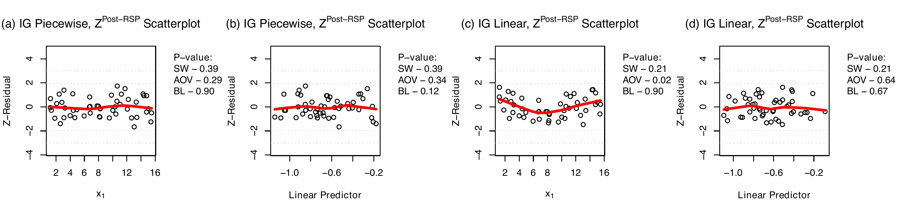
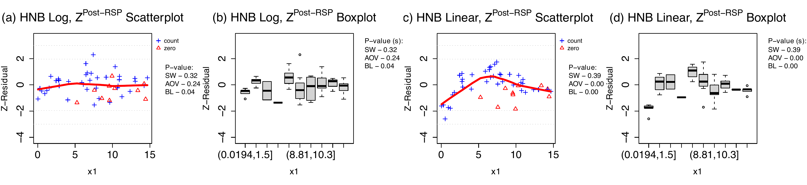
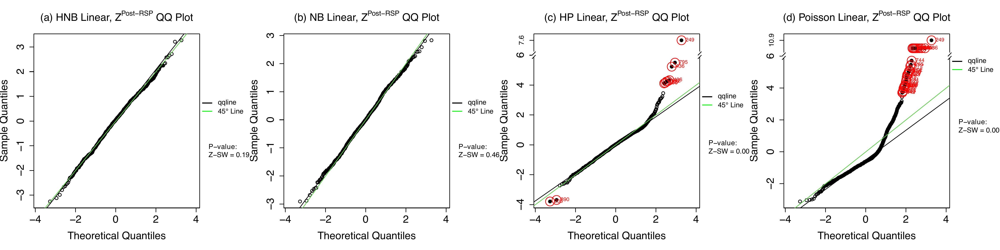
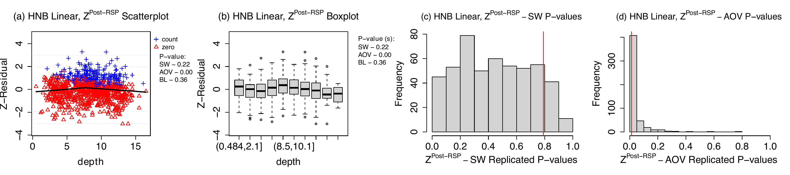
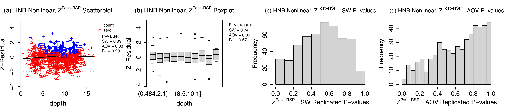

 

## Outline {.unnumbered}

1. **Introduction & Motivation**
   * The Diagnostic Gap in Bayesian Modeling
   * Limitations of Posterior Predictive Checks (PPC)
2. **Methodology: The Z-residual Framework**
   * Randomized Survival Probability (RSP)
   * Posterior and ISCV Z-residuals
   * Asymptotic Guarantees
3. **Simulation Studies**
   * Continuous Inverse Gaussian Regression
   * Discrete Hurdle Negative Binomial Regression
4. **Application to a Zero-inflated Dolphin-Sighting Dataset**

5. **Conclusion & Future Directions**

<div style="display: none;">
$$
% --- Custom Commands for MathJax ---

\newcommand{\bm}[1]{\boldsymbol{#1}}

% Acronyms and Custom Text
\newcommand{\CVIC}{\text{CVIC}}
\newcommand{\deviance}{\text{dev}}
\newcommand{\dpois}{\text{dpois}}
\newcommand{\ic}{\text{ic}}
\newcommand{\nmsp}{\text{\scriptsize NMSP}}
\newcommand{\nrsp}{\text{\scriptsize NRSP}}
\newcommand{\pmin}{p_{\text{\scriptsize min}}}
\newcommand{\pp}{\text{pp}}
\newcommand{\nref}{[\textbf{references}]}
\newcommand{\svf}{S_{i}(\cdot)}
\newcommand{\unif}{\text{Unif}}
\newcommand{\rsp}{\text{RSP}}
\newcommand{\msp}{\text{MSP}}
\newcommand{\PPP}{\text{PPP}}
\newcommand{\PPPs}{\text{PPPs}}
\newcommand{\PPC}{\text{PPC}}
\newcommand{\bU}{\bm{U}}
\newcommand{\pv}{\mathcal{P}}

% Math Symbols (Bold)
\newcommand{\btheta}{\bm{\theta}}
\newcommand{\bTheta}{\bm{\Theta}}
\newcommand{\bx}{\bm{x}}
\newcommand{\by}{\bm{y}}
\newcommand{\bY}{\bm{Y}}
\newcommand{\bbeta}{\bm{\beta}}
\newcommand{\bBeta}{\bm{\Beta}}
\newcommand{\blambda}{\bm{\lambda}}
\newcommand{\bmu}{\bm{\mu}}
\newcommand{\bphi}{\bm{\phi}}
\newcommand{\bp}{\bm{p}}
\newcommand{\bsgm}{\bm{\sigma}}
\newcommand{\hu}{\pi^o_{i}}
\newcommand{\mhu}{\pi^o}

% General Superscripts and Subscripts
\newcommand{\obs}{^{\text{obs}}}
\newcommand{\sobs}{^{\text{obs}}}
\newcommand{\post}{^{\text{Post}}}
\newcommand{\cv}{^{\text{CV}}}
\newcommand{\iscv}{^{\text{ISCV}}}
\newcommand{\supt}{^{(t)}}
\newcommand{\mci}{^{(t)}}        
\newcommand{\mcs}{^{(s)}}
\newcommand{\rep}{^{\text{rep}}}
\newcommand{\ppc}{_{\text{ppc}}}
\newcommand{\noi}{_{-i}}
\newcommand{\wi}{_{1:n}}
\newcommand{\IS}{^{\text{\scriptsize IS}}}

% Compound Superscripts for Z-residuals
\newcommand{\rspp}{^{\text{Post-RSP}}}
\newcommand{\mspp}{^{\text{Post-MSP}}}
\newcommand{\rspis}{^{\text{ISCV-RSP}}}
\newcommand{\mspis}{^{\text{ISCV-MSP}}}
\newcommand{\rsppost}{^{\text{Post-RSP }}} 
\newcommand{\rspiscv}{^{\text{ISCV-RSP}}} 
\newcommand{\E}{\mathbb{E}}
\newcommand{\Epost}{\mathbb{E}_{\btheta \mid \by}}
\newcommand{\Ecv}{\mathbb{E}_{\btheta \mid \by_{-i}}}
\newcommand{\highlight}[1]{\textcolor{blue}{#1}}
\newcommand{\norm}[1]{\left\lVert#1\right\rVert}
\newcommand{\textred}[1]{\textcolor{orange}{#1}}
$$
</div>


# Introduction

## Where We Stand: Current Model Checking Methods

* **Frequentist Residual Diagnostics:** In OLS, observation-level residuals play important roles for visualizing and quantifying overall and specific structural flaws (e.g., normality, nonlinearity, heteroskedasticity, spatial and temporal dependency).

* **The Gap in Assessing Bayesian Model:s** This comprehensive diagnostic toolkit is largely unavailable for general Bayesian models

* **Limitations of Posterior Predictive Checks (PPC)**

  * **Arbitrary Statistics:** Operates on a *test-first, then-summarize* paradigm, requiring subjective choices for dataset-level discrepancy statistics.
  * **Masked Flaws:** Relying on marginal distribution checks often fails to detect subtle covariate-specific or other structural misspecifications.
  * **Double-Use Bias:** Evaluating the statistic on the exact data used for fitting degrades statistical power, causing $p$-values to cluster around 0.5.
  * **Trade-offs in Alternatives:** Methods like holdout predictive checks (HPC) mitigate bias but sacrifice effective sample size and power.

## Z-residual Diagnostics

* **A Versatile Diagnostic Framework:** Introduces observation-level residuals for Bayesian models based on Randomized Survival Probability (RSP).
* **"Summarize-first, then-test":** Averages parameter-wise RSPs over the posterior (or LOO posterior) before transforming them into standard normal Z-residuals.
* **Key Advantages of Z-residuals:**
  * **Asymptotically Calibrated:** Diagnostic $p$-values are uniformly distributed under the true model, overcoming PPC's double-use bias.
  * **Diagnostic Richness:** Enables the use of familiar graphical tools (scatterplots, QQ plots) and structural tests (ANOVA, Shapiro-Wilk) on a single set of residuals.
  * **Preserved Power:** Utilizes the full sample size to detect model misspecifications without the reductions required by holdout methods.

# Posterior Predictive Checks

## Posterior Predictive P-value ($\PPP$)

* **Concept:** $\PPP$ is a goodness-of-fit measure comparing observed data ($\by^{\text{obs}}$) to replicated data ($\by^{\text{rep}}$) from the posterior predictive model. Good models generate replicates similar to the observed data.
* **Discrepancy Statistic $T(\by, \btheta)$:** Summarizes specific data features (potentially depending on parameters $\btheta$). $\PPP$ is the probability that the replicated discrepancy exceeds the observed one:
  $$ \PPP = P(T(\by^{\text{rep}}, \btheta) > T(\by^{\text{obs}}, \btheta) \mid \by^{\text{obs}}) $$
* **A Key Simplification (Meng, 1994):** If the discrepancy is a well-calibrated $p$-value, $\mathcal{P}(\by, \btheta)$, its replicate is exactly $\mathrm{Unif}(0,1)$. By the law of iterated expectations, $\PPP$ simplifies to the posterior average of observed $p$-values:
  $$ \PPP = \E(\pv(\by^{\text{obs}}, \btheta) \mid \by^{\text{obs}}) $$

## Computing Procedures of PPP

1. **Sample from Posterior:**
Begin with a set of posterior samples $\{\btheta_{s}\}_{s=1}^S$.


2. **Compute Discrepancy Statistics:** For each sample $s$, compute two statistics:

   * **Replicated Statistic (optional):**  $T^{\text{rep}}_{s}$ calculated with $\boldsymbol{y}_{s}^{\text{rep}} \sim p(\boldsymbol{y} \mid \btheta_{s})$
   * **Observed Statistic:** $T^\text{obs}_{s}$ calculated with the actual data $\boldsymbol{y}^\text{obs}$


3. **Aggregate & Compare:**
Collect all $S$ results and calculate the proportion of draws where the replicated statistic is greater than or equal to the observed statistic; alternatively, calculate the posterior mean of $p$-values:


$$\widehat{\PPP} = \frac{1}{S} \sum_{s=1}^{S} I(T_{s}^{\text{rep}} \ge T_{s}^\text{obs}), \text{or, }
\widehat{\PPP}= \frac{1}{S}\sum_{s=1}^{S} \pv(\by^{\text{obs}},\btheta^{(s)}) 
$$

## Limitations of PPC and HPC

1. **Arbitrary Discrepancy Measures:**
   The selection of the test statistic, $T(\by, \btheta)$, is inherently arbitray, lacking guidelines from data fitting results.

2. **Masking of Structural Flaws:**
   Relying on simple, marginal statistics (e.g., mean, median, or standardized deviations as used in $\chi^2$ statistic) can yield a "passing" score while hiding critical deficiencies like misspecified covariate functional forms.

3. **The "Test-First, Then-Summarize" Paradigm:**
   Computing dataset-level discrepancies for every MCMC draw evaluates the model against its exact training data, severely exacerbating double-use bias.

4. **Poor Calibration & Low Power:**
   Due to double-use bias, PPC $p$-values (especially $\chi^2$) are rarely uniform under the null. They artificially cluster around $0.5$, crippling the test's power to detect true model misfit.

5. **The Holdout Predictive Check (HPC) Compromise:**
   Recently proposed to replace PPCs, HPC splits the data into training and test sets to eliminate double-use bias. However, this data-splitting drastically reduces the effective sample size, leading to a severe loss of statistical power and instability in the evaluation.

# The Z-residual Framework

## Randomized Survival Probability (RSP)


* For an observed $y_i$, the parameter-wise RSP is:
  $$ \text{RSP}_i(y_i \mid \boldsymbol{\theta}) = S_i(y_i \mid \boldsymbol{\theta}) + U_i \cdot p_i(y_i \mid \boldsymbol{\theta}) $$
  * $S_i$: Survival function $P(Y_i > y_i \mid \boldsymbol{\theta})$
  * $p_i$: Probability mass function $P(Y_i = y_i \mid \boldsymbol{\theta})$
  * $U_i \sim \text{Unif}(0,1)$: Auxiliary randomization
* **Auxilliary Randomization $U_i$**
  * **Continuous**: $p_i = 0$, simplifies to the standard probability integral transform.
  * **Discrete**: Randomization ensures exact uniform distribution on $[0,1]$. Essentially, the randomization recovers the continuous latent constructs of a discrete $y_i$ by injecting random noise. 

## The Parameter-wise Z-residual

* Transform the uniform RSP into a standard normal residual using the inverse-survival function of $N(0,1)$:
  $$ z_i^{\text{RSP}}(y_i \mid \boldsymbol{\theta}) = -\Phi^{-1}(\text{RSP}_i(y_i \mid \boldsymbol{\theta})) $$
* **Interpretation:**
  * Negative sign preserves traditional residual direction (larger observations = positive residuals).
  * Represents distance from $y_i$ to its predictive median, rescaled for skewness and smoothed for discreteness.
  * Under the true model, 
   $$z_i^{\text{RSP}}(y_i \mid \boldsymbol{\theta})  \sim N(0,1)$$

## Illustration with Animation

## Accounting for Uncertainty: Posterior Z-residuals

* In Bayesian contexts, $\boldsymbol{\theta}$ is unknown. We average the pointwise RSP over the posterior distribution $\pi(\boldsymbol{\theta} \mid \mathbf{y})$.
* **Posterior RSP:**
  $$ \widehat{\text{RSP}}_i^{\text{post}}(y_i) = \frac{1}{T} \sum_{t=1}^T \text{RSP}_i(y_i \mid \boldsymbol{\theta}^{(t)}) $$
* **Posterior Z-residual:**
  $$ z_i^{\text{post}}(y_i) = -\Phi^{-1}\left(\widehat{\text{RSP}}_i^{\text{post}}(y_i)\right) $$


 
## Mitigating Double-use: ISCV Z-residuals

* Posterior Z-residuals use $\mathbf{y}$ twice. To mitigate finite-sample bias, we approximate Leave-One-Out (LOO) cross-validation via Importance Sampling (ISCV).
* **ISCV RSP:** Weighted average using inverse-likelihood weights $w_i^{\text{IS}}(\boldsymbol{\theta}^{(t)}) = 1 / f_i(y_i \mid \boldsymbol{\theta}^{(t)})$.
  $$ \widehat{\text{RSP}}_i^{\text{ISCV}}(y_i) = \frac{\sum_{t=1}^T \left[ \text{RSP}_i(y_i \mid \boldsymbol{\theta}^{(t)}) w_i^{\text{IS}}(\boldsymbol{\theta}^{(t)}) \right]}{\sum_{t=1}^T w_i^{\text{IS}}(\boldsymbol{\theta}^{(t)})} $$
* **ISCV Z-residual:**
  $$ z_i^{\text{ISCV}}(y_i) = -\Phi^{-1}\left(\widehat{\text{RSP}}_i^{\text{ISCV}}(y_i)\right) $$


## A Paradigm Shift

| Feature | Posterior Predictive Checks (PPC) | Z-residuals Diagnostics |
| :- | :------- | :------- |
| **Workflow** | **Test-first, then-summarize** | **Summarize-first, then-test** |
| **Mechanics** | Compute stat $T$ for every MCMC draw, average $p$-values. | Average probabilities over MCMC draws, compute *single* set of $Z$. |
| **Calibration** | Poor (conservative bias scaling with $p$). | Asymptotically uniform/normal. |
| **Power** | Low | High (full sample size used). |
| **Versatility** | Limited structural targeted checks. | Enables AOV, SW, heteroskedasticity tests analogous to OLS. |

## Computing Procedures {.smaller}

**PPC with Parameter-wise Z-residuals**

|  | $y_1$ | $y_2$ | $\cdots$ | $y_n$ |  |  |
| --- | --- | --- | --- | --- | --- | --- |
| $\btheta^{(1)}$ | $z_1^{\rsp}(y_1 \mid \btheta^{(1)})$ | $z_2^{\rsp}(y_2 \mid \btheta^{(1)})$ | $\cdots$ | $z_n^{\rsp}(y_n \mid \btheta^{(1)})$ | $\xrightarrow{\text{Test}}$ | $p_1\sobs$ |
| $\btheta^{(2)}$ | $z_1^{\rsp}(y_1 \mid \btheta^{(2)})$ | $z_2^{\rsp}(y_2 \mid \btheta^{(2)})$ | $\cdots$ | $z_n^{\rsp}(y_n \mid \btheta^{(2)})$ | $\xrightarrow{\text{Test}}$ | $p_2\sobs$ |
| $\vdots$ | $\vdots$ | $\vdots$ | $\ddots$ | $\vdots$ |  | $\vdots$ |
| $\btheta^{(T)}$ | $z_1^{\rsp}(y_1 \mid \btheta^{(T)})$ | $z_2^{\rsp}(y_2 \mid \btheta^{(T)})$ | $\cdots$ | $z_n^{\rsp}(y_n \mid \btheta^{(T)})$ | $\xrightarrow{\text{Test}}$ | $p_T\sobs$ |
|  |  |  |  |  |  | $\downarrow$ |
|  |  |  |  |  |  | **PPP** |

**Z-Residual Diagnostics**

|  | $y_1$ | $y_2$ | $\cdots$ | $y_n$ |  |  |
| --- | --- | --- | --- | --- | --- | --- |
| $\btheta^{(1)}$ | $\rsp_1(y_1 \mid \btheta^{(1)})$ | $\rsp_2(y_2 \mid \btheta^{(1)})$ | $\cdots$ | $\rsp_n(y_n \mid \btheta^{(1)})$ |  |  |
| $\btheta^{(2)}$ | $\rsp_1(y_1 \mid \btheta^{(2)})$ | $\rsp_2(y_2 \mid \btheta^{(2)})$ | $\cdots$ | $\rsp_n(y_n \mid \btheta^{(2)})$ |  |  |
| $\vdots$ | $\vdots$ | $\vdots$ | $\ddots$ | $\vdots$ |  |  |
| $\btheta^{(T)}$ | $\rsp_1(y_1 \mid \btheta^{(T)})$ | $\rsp_2(y_2 \mid \btheta^{(T)})$ | $\cdots$ | $\rsp_n(y_n \mid \btheta^{(T)})$ |  |  |
|  | $\downarrow$ | $\downarrow$ |  | $\downarrow$ |  |  |
| $z_i^{\rsp}$ | $z^{\rsp}_1(y_1)$ | $z^{\rsp}_2(y_2)$ | $\cdots$ | $z^{\rsp}_n(y_n)$ | $\xrightarrow{\text{Test}}$ | $Z^{\rsp}$ $p$-value |

## Asymptotic Properties of Posterior and ISCV Z-residuals {.smaller}

**Theorem 1** (Total variation convergence of the LOO predictive distribution, informal statement).
*Let $Y_1,\dots,Y_{n+1}$ be independent with true densities $f_i^{(*)}$, and suppose the model $\{f_i(\cdot\mid\theta):\theta\in\Theta\}$ with prior $\Pi$ is well-specified, so that the true parameter set $W_0=\{\theta\in\Theta: f_i(\cdot\mid\theta)=f_i^{(*)} \text{ for all } i\}$ is non-empty. Assume standard regularity conditions ensuring posterior consistency and predictive continuity (specifically, conditions (i)--(v) of supplementary §S-supp:proofs). Under these conditions, the LOO predictive distribution $P_i^{(n),\mathrm{CV}}$ converges to the true distribution $P_i^{(*)}$ in total variation, in probability: for each fixed $i$,*

$$\big\Vert{}P_i^{(n),\mathrm{CV}}-P_i^{(*)}\big\Vert{}_{\mathrm{TV}} \xrightarrow{P} 0 \quad \text{as } n\to\infty.$$

Because each observation's RSP is computed from a predictive distribution that converges to the truth, the RSPs themselves inherit the correct limiting behavior, not only marginally but also jointly across observations:

**Theorem 2** (Asymptotic independence of cross-validated RSPs).
*Under the assumptions of Theorem S-thm:loo-pred-tv-formal-w0, for any fixed pair of distinct indices $i \neq j$, the cross-validated RSPs converge jointly in distribution to a pair of independent standard uniform random variables: as $n\to\infty$,*

$$\big(\mathrm{RSP}_i^{(n),\mathrm{CV}},\, \mathrm{RSP}_j^{(n),\mathrm{CV}}\big) \ \Rightarrow\ \big(\mathrm{Uniform}(0,1),\,\mathrm{Uniform}(0,1)\big),$$

*where the two limiting uniform variables are independent.*

## Summarizing Replicated Test $p$-values

* For discrete data, auxiliary randomization $\mathbf{U}$ means test $p$-values vary across random seeds.
* **Solution:** Redraw $\mathbf{U}$ $J$ times, yielding replicated $p$-values $\{p_j(\mathbf{y})\}_{j=1}^J$.
* We derive a distribution-free upper-bound for the order statistic (e.g., median):
  $$ P\{p_{(r)}(\mathbf{y}) \le t\} \le H_{J,r} \cdot t $$
* The value of $H_{J,r}$ can be computed using numerical optimization. For the median ($r=\lceil J/2\rceil$), $H_{100,50}\approx 1.65$, and $H_{500,250}\approx 1.80$. 
* Yields a single, super-uniform $p$-value summary without requiring nested MCMC simulations.


#  Simulation Studies

```{r}
#| include: false
#| eval: false
# Find all PDF files in the "plot" directory
pdf_files <- list.files(path = "plot", pattern = "\\.pdf$", full.names = TRUE)

# Loop through and convert each one
for (pdf in pdf_files) {
  # Define the new .png file name
  png_name <- sub("\\.pdf$", ".png", pdf)
  
  # Read with high resolution, make transparent, and save
  img <- magick::image_read_pdf(pdf, pages = 1, density = 300) |>
    magick::image_transparent(color = "white", fuzz = 2)
  
  magick::image_write(img, path = png_name, format = "png")
  
  cat("Converted:", png_name, "\n")
}
```

## Simulation 1: Inverse Gaussian (IG) Regression

* **Setup:** Continuous data. $n \in \{50, 100, 200\}$. No auxiliary randomization needed.
* **DGP:** True model has a piecewise quadratic effect for covariate $X_1$.
* **Fitted Models:**
  1. **Correct:** Piecewise IG model.
  2. **Misspecified:** Linear IG model (misses the nonlinear effect of $X_1$).
* **Goal:** Evaluate capability to detect specific functional-form misspecifications.


## Visual Diagnostics (IG, $n=50$)

{fig-align="center"}

* **Correct Model (a)(b)**: No trend against $X_1$ or fitted values.
* **Misspecified Model (c)(d):** Clear nonlinear pattern against $X_1$ (c), but masked when plotted against the overall linear predictor (d). *Covariate-specific plots are essential.*


## Empirical $p$-value Distributions (IG)

{fig-align="center"}

* **Blue = Correct Model, Red = Misspecified Model.**
* Z-residual AOV tests (e, f) are uniform under correct model, strongly concentrated near zero under wrong model. SW/$\chi^2$ lack power.


## Rejection Rates & Power (IG)

{width=100%}

* Z-AOV (b) maintains nominal $\alpha=0.05$ (black) and achieves rapidly increasing power (red) as $n$ grows.
* Traditional SW (a) and $\chi^2$ (c) fail to detect localized mean misspecification.


## Simulation 2: Hurdle Negative Binomial (HNB)

* **Setup:** Discrete count data with excess zeros ($\approx 30\%$). $n \in \{50, 100, 200\}$. Requires auxiliary randomization $U$.
* **DGP:** True model has a logarithmic effect $\log(X_1)$ in the count component.
* **Fitted Models:**
  1. **Correct:** Logarithmic HNB.
  2. **Misspecified:** Linear HNB.
* **Goal:** Detect nonlinear mean misspecification in zero-inflated count data.


## Visual Diagnostics (HNB, $n=50$)

{width=80%}

* **Top (Correct):** Residuals scattered, boxplots homogeneous across $X_1$ bins.
* **Bottom (Misspecified):** Pronounced grouped mean differences across $X_1$. Detected by AOV grouped test.


## Empirical $p$-value Distributions (HNB)

{width=70%}

* AOV tests (e, f) based on posterior/ISCV Z-residuals remain well calibrated (blue) and highly powerful (red). PPC and HPC methods cluster near $0.5$ under the null.


## Rejection Rates & Power (HNB)

{width=100%}

* Z-AOV maintains low Type-I error rates (black) and achieves nearly $100\%$ power for $n \ge 100$ (red). PPC AOV performs well but lags at smaller sample sizes.


#  Real-World Application


## Dolphin-Sighting Dataset

* **Data:** $n=936$ observations, estuarine–coastal gradient.
* **Response:** Count of dolphin sightings (extremely sparse, $\sim 75\%$ zeros).
* **Covariates:** Water depth, temperature, distance to river mouth, salinity, turbidity, year, location.
* **Initial Strategy:** Fit linear models across 4 families: 
  * Hurdle Poisson, Hurdle Negative Binomial (HNB)
  * Poisson, Negative Binomial (NB)


## Overall Goodness-of-Fit (Linear Models)

{width=100%}

* **Result:** HNB (a) and NB (b) show adequate overall fit (adhering to diagonal, SW $p \ge 0.05$). Poisson models (c, d) fail dramatically due to unmodeled overdispersion.


## Detecting Nonlinearity in Depth

{width=70%}

* Plotting linear HNB Z-residuals against `depth` reveals a clear **U-shape** (a) and heterogeneous grouped boxplots (b).
* AOV test confirms severe non-linearity (median upper-bound $p$-value = $0.012$).


## The Refined Nonlinear Model

{width=70%}

* **Refinement:** Added piecewise quadratic effect for `depth` based on visual turning point at 7.95m.
* **Result:** Patterns eliminated. Scatterplot and boxplots are homogeneous. AOV test $p$-value climbs to $1.00$.


## Model Comparison

| Family | Model Type | Z-SW $p$ | Z-AOV $p$ | $\Delta_{\text{elpd}}$ (LOO) |
| :--- | :--- | :--- | :--- | :--- |
| **HNB** | **Nonlinear** | $1.000$ | $1.000$ | **$0.0$** |
| HNB | Linear | $0.790$ | $0.012$ | $-19.9$ |
| NB | Nonlinear | $0.337$ | $0.760$ | $-34.0$ |
| NB | Linear | $0.299$ | $0.010$ | $-42.5$ |
| HP | Linear | $<0.01$ | $0.020$ | $-118.6$ |

* The **Nonlinear HNB** model satisfies all diagnostic checks and significantly outperforms all other models out-of-sample.
* The nonlinear effect primarily acts on the *hurdle* component (zero-inflation probability increases away from 7.95m depth).


#  Conclusion & Future Directions


## Summary of Contributions

* **Methodological Shift:** Transitioned from "test-first, then summarize" (PPC) to "summarize-first, then test" (Z-residuals).
* **Asymptotic Calibration:** Posterior and ISCV Z-residuals converge to standard normal, ensuring well-calibrated $p$-values.
* **Diagnostic Versatility:** Enables targeted tests (AOV, SW) that uncover structural flaws (like functional form misspecification) which omnibus checks miss.
* **Preserved Power:** Uses full sample size without holdout reductions.


## Limitations & Future Directions

* **Limitations:**
  * Strict observation-level focus: Insensitive to internal/latent structure misspecifications (hierarchical effects, priors).
* **Future Work:**
  * Extend framework to internal model components (synergizing with Uniform Parametrization Checks).
  * Expand the suite of targeted Z-residual tests (e.g., spatial dependence, formal e-values for multiple testing correction).
  * Improve computational efficiency for summarizing simulated $p$-values over auxiliary $\mathbf{U}$.


## Questions?

**Thank you.**

*Paper: "Z-residuals: A Versatile Diagnostic Framework for Bayesian Models"*